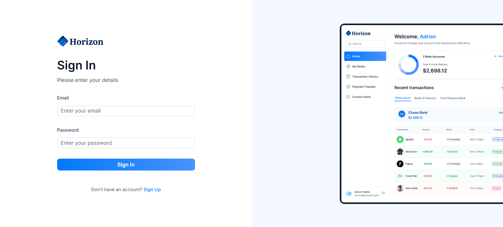
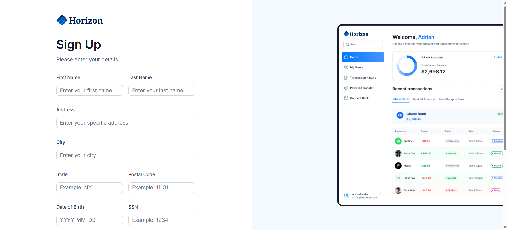
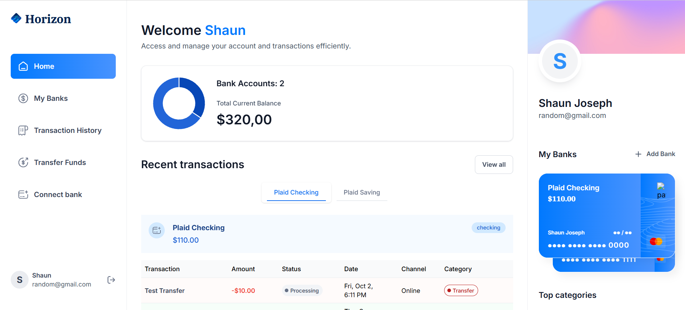
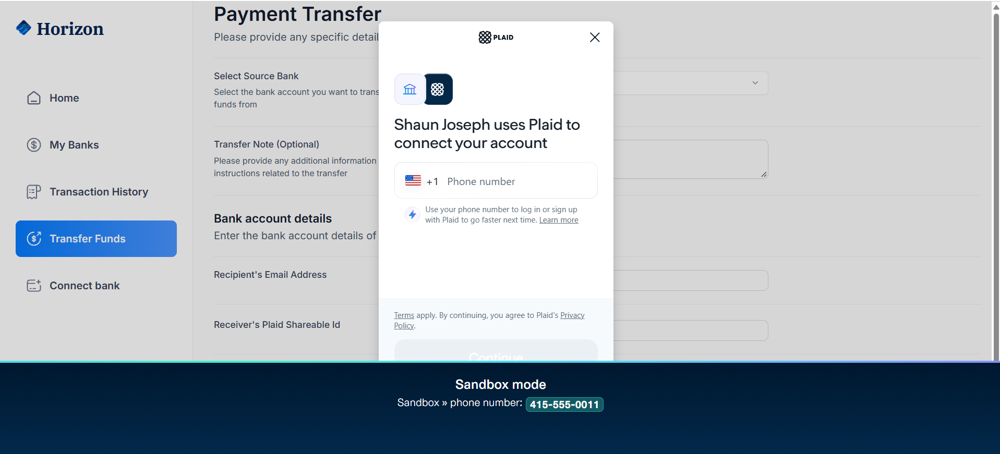
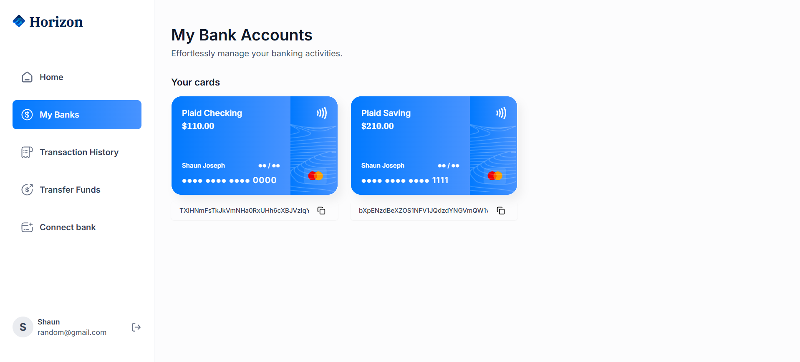
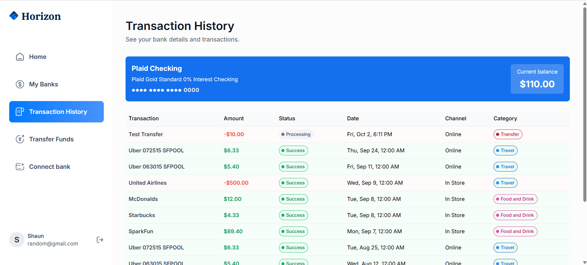
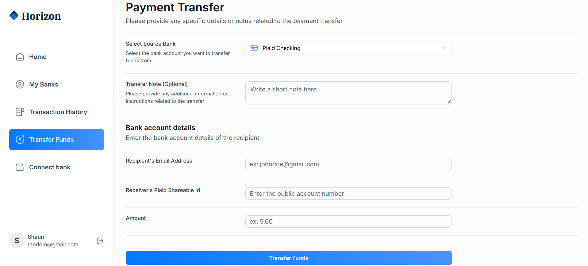

# 🚀 Horizon: Modern Banking Dashboard

**Horizon** is a modern, full-stack financial SaaS platform designed to provide users with a centralized and intuitive interface for managing multiple bank accounts and monitoring personal finances.

The platform enables users to securely authenticate, connect external bank accounts through **Plaid**, view aggregated account balances, analyze transaction activity, and initiate fund transfers through a clean and responsive dashboard.

By combining **Next.js, React, TypeScript, Appwrite, Plaid, Tailwind CSS, shadcn/ui, Sentry, and Vercel**, Horizon provides a complete modern web application architecture focused on usability, financial data visualization, and secure account management.

## 🌐 Live Demo

**Live Application:**
https://horizon-sandy-ten.vercel.app/

---

## ✨ Key Features

### 🔐 Secure Authentication & Onboarding

Horizon provides a complete authentication and onboarding experience for users.

* User registration and sign-in flows
* Secure session management
* User-specific financial data
* Structured onboarding experience
* Authentication powered by Appwrite

The authentication layer ensures that users can access and manage their financial information through their own secure accounts.

---

### 🏦 Plaid Bank Integration

Horizon uses **Plaid** to securely connect external financial institutions with the application.

Users can connect their bank accounts through the Plaid Link interface and allow Horizon to retrieve relevant financial information.

Key capabilities include:

* Secure bank account linking
* External financial institution integration
* Retrieval of account information
* Access to transaction data
* Support for multiple connected bank accounts

This allows users to manage information from different financial institutions through a single dashboard.

---

### 📊 Centralized Financial Dashboard

The main dashboard provides a consolidated overview of the user's financial information.

It includes:

* Total current balance across connected accounts
* Individual bank account information
* Aggregated financial data
* Interactive visual representations
* Donut chart for account balance distribution
* Quick access to recent financial activity

Instead of navigating through individual banking platforms, users can view their connected financial accounts from one centralized interface.

---

### 💳 Detailed Transaction History

Horizon provides a dedicated transaction management experience where users can explore their financial activity.

Transactions are displayed with relevant information such as:

* Transaction name
* Transaction category
* Transaction date
* Transaction amount
* Transaction status
* Associated bank account

Transactions can be categorized into areas such as:

* Travel
* Food and Drink
* Transfer
* Other financial activities

The transaction history also supports pagination, making it easier to navigate through larger transaction datasets.

---

### 🏛️ Multi-Account Management

The **My Banks** section provides a dedicated interface for managing connected bank accounts.

Each linked account is presented as an interactive banking card containing relevant account information.

Users can:

* View connected financial institutions
* Switch between linked accounts
* Review account information
* Access account-specific details
* Reference shareable account IDs

This provides a unified experience for users who manage multiple bank accounts.

---

### 💸 Real-Time Fund Transfers

Horizon includes a streamlined transfer interface for initiating payments between accounts.

The transfer workflow allows users to:

1. Select a source bank account
2. Enter recipient information
3. Specify the transfer amount
4. Review the transfer details
5. Initiate the payment

The interface is designed to simplify the process of managing transfers while keeping the required information organized in a single workflow.

---

## 🛠️ Tech Stack

Horizon is built using a modern full-stack web architecture.

| Technology       | Purpose                                                 |
| ---------------- | ------------------------------------------------------- |
| **Next.js**      | Full-stack React framework and application architecture |
| **React**        | Component-based frontend development                    |
| **TypeScript**   | Type-safe application development                       |
| **Tailwind CSS** | Utility-first responsive styling                        |
| **shadcn/ui**    | Reusable and accessible UI components                   |
| **Appwrite**     | Authentication and database services                    |
| **Plaid**        | Secure banking and financial data integration           |
| **Sentry**       | Application error tracking and monitoring               |
| **Vercel**       | Application deployment and hosting                      |

### Frontend

The frontend is developed using **Next.js, React, and TypeScript**, with **Tailwind CSS** providing responsive styling and **shadcn/ui** providing reusable interface components.

### Backend / BaaS

**Appwrite** is used as the backend-as-a-service layer for authentication and database operations.

### Banking API

**Plaid** provides the financial institution integration required to securely connect external bank accounts and retrieve financial data.

### Error Tracking

**Sentry** is integrated for monitoring application errors and improving application reliability.

### Deployment

The application is deployed using **Vercel**, providing a production-ready hosting environment for the Next.js application.

---

# 📸 Application Previews

The following screenshots demonstrate the major interfaces and workflows available in Horizon.

## 🔐 User Authentication

The authentication interface provides users with dedicated sign-in and registration experiences.

### Sign In



### Sign Up



---

## 📊 Main Dashboard & Bank Linking

The main dashboard provides an overview of connected financial accounts, balances, and financial activity.

### Homepage Overview



### Connect Bank

Users can connect external financial institutions through the integrated Plaid Link experience.



---

## 🏦 Multi-Account Management

The **My Banks** interface provides a visual representation of all linked financial accounts.



---

## 💰 Transaction Management & Transfers

Horizon provides dedicated interfaces for reviewing transaction history and initiating fund transfers.

### Transaction History



### Transfer Funds



---

# 🛠️ Quick Start

Follow the steps below to run Horizon locally for development.

## 📋 Prerequisites

Before getting started, make sure the following requirements are available on your system:

* **Node.js** installed
* An **Appwrite** account and project
* A **Plaid** account and API credentials
* A **Sentry** account and project
* Git installed for cloning the repository

---

## 1. Clone the Repository

Clone the project from GitHub and navigate into the project directory:

```bash
git clone https://github.com/Shaun07a/Horizon.git
cd Horizon
```

---

## 2. Install Dependencies

Install all required project dependencies using npm:

```bash
npm install
```

This will install the packages required by the Next.js application and its associated services.

---

## 3. Configure Environment Variables

Create a `.env.local` file in the root directory of the project.

Add the following required environment variables:

```env
# Next.js
NEXT_PUBLIC_SITE_URL=https://horizon-sandy-ten.vercel.app/

# Appwrite
NEXT_PUBLIC_APPWRITE_ENDPOINT=
NEXT_PUBLIC_APPWRITE_PROJECT=
APPWRITE_DATABASE_ID=
APPWRITE_USER_COLLECTION_ID=
APPWRITE_BANK_COLLECTION_ID=
APPWRITE_TRANSACTION_COLLECTION_ID=
APPWRITE_SECRET=

# Plaid
PLAID_CLIENT_ID=
PLAID_SECRET=
PLAID_ENV=
PLAID_PRODUCTS=
PLAID_COUNTRY_CODES=

# Sentry
NEXT_PUBLIC_SENTRY_DSN=
```

These environment variables provide the application with the configuration and credentials required to communicate with **Appwrite, Plaid, and Sentry**.

> **Important:** Never commit `.env.local` or other files containing private API credentials and secrets to a public repository.

---

## 4. Start the Development Server

Once the dependencies and environment variables have been configured, start the Next.js development server:

```bash
npm run dev
```

The application should now be available at:

**http://localhost:3000**

Open the URL in your browser to access the Horizon dashboard locally.

---

# 📁 Project Overview

At a high level, Horizon brings together several services to create a centralized financial management experience:

```text
User
  │
  ▼
Horizon Web Application
  │
  ├── Authentication
  │     └── Appwrite
  │
  ├── Bank Connections
  │     └── Plaid
  │
  ├── Financial Data
  │     └── Appwrite Database
  │
  ├── Error Monitoring
  │     └── Sentry
  │
  └── Deployment
        └── Vercel
```

This architecture allows the frontend application to provide a unified interface while relying on specialized services for authentication, database management, financial institution connectivity, monitoring, and deployment.

---

# 🎯 Project Objective

The primary objective of Horizon is to demonstrate how modern web technologies can be combined to build a centralized financial management platform.

The application brings together:

* Secure authentication
* Multiple bank account connections
* Financial data aggregation
* Transaction management
* Financial visualization
* Fund transfer workflows
* Cloud-based backend services
* Application monitoring
* Modern web deployment

Through this combination, Horizon provides a comprehensive example of building a production-style financial SaaS application using a modern JavaScript/TypeScript ecosystem.

---

## 🌐 Links

**Live Demo:**
https://horizon-sandy-ten.vercel.app/

**GitHub Repository:**
https://github.com/Shaun07a/Horizon
